<div align="center">

# Prompt Forge

Build character prompts and image tags for local models

[![Live][badge-site]][url-site]
[![HTML5][badge-html]][url-html]
[![CSS3][badge-css]][url-css]
[![JavaScript][badge-js]][url-js]
[![Claude Code][badge-claude]][url-claude]
[![License][badge-license]](LICENSE)

[badge-site]:    https://img.shields.io/badge/live_site-0063e5?style=for-the-badge&logo=googlechrome&logoColor=white
[badge-html]:    https://img.shields.io/badge/HTML5-E34F26?style=for-the-badge&logo=html5&logoColor=white
[badge-css]:     https://img.shields.io/badge/CSS3-1572B6?style=for-the-badge&logo=css3&logoColor=white
[badge-js]:      https://img.shields.io/badge/JavaScript-F7DF1E?style=for-the-badge&logo=javascript&logoColor=black
[badge-claude]:  https://img.shields.io/badge/Claude_Code-CC785C?style=for-the-badge&logo=anthropic&logoColor=white
[badge-license]: https://img.shields.io/badge/license-MIT-404040?style=for-the-badge

[url-site]:   https://promptforge.neorgon.com/
[url-html]:   #
[url-css]:    #
[url-js]:     #
[url-claude]: https://claude.ai/code

</div>

---

## Overview

Prompt Forge builds context-rich character prompts for local LLMs and converts plain descriptions into comma-separated tags for image models. Everything runs in the browser, so your prompts never leave your machine.

**Live:** promptforge.neorgon.com

---

## Features

- **Character builder** -- Pick a preset, tune behavior sliders, and export a system prompt that avoids cliches and question loops
- **Tag formatter** -- Turn natural language like "sitting on a bed" into model-ready tags such as "sit, alone, bed"
- **Multiple exports** -- Copy or download Markdown, LM Studio JSON, or SillyTavern JSON
- **Uncensored mode** -- Tag formatter works with any prompt without forced filtering
- **Local-only** -- No API calls, no tracking, no server-side processing

---

## Running locally

ES modules require an HTTP server (not `file://`):

```bash
make serve
```

Or with Python directly:

```bash
python3 -m http.server 8842
```

Then open http://localhost:8842.

---

## Architecture



```
prompt-forge-site/
├── index.html              # App shell with two modes
├── css/style.css           # Neorgon design tokens + app styles
├── js/
│   ├── app.js              # Entry point
│   ├── state.js            # Shared state + localStorage
│   ├── render.js           # DOM updates
│   ├── events.js           # User interactions
│   ├── presets.js          # Character base templates
│   ├── prompts.js          # Prompt generation + export formats
│   └── tags.js             # Natural-language to tag conversion
├── CNAME                   # Custom domain: promptforge.neorgon.com
├── robots.txt              # Search engine rules
├── sitemap.xml             # Single-page sitemap
├── Makefile                # Local dev server on port 8842
└── README.md               # This file
```

---

<div align="center">
<sub>Part of <a href="https://neorgon.com/">Neorgon</a></sub>
</div>
